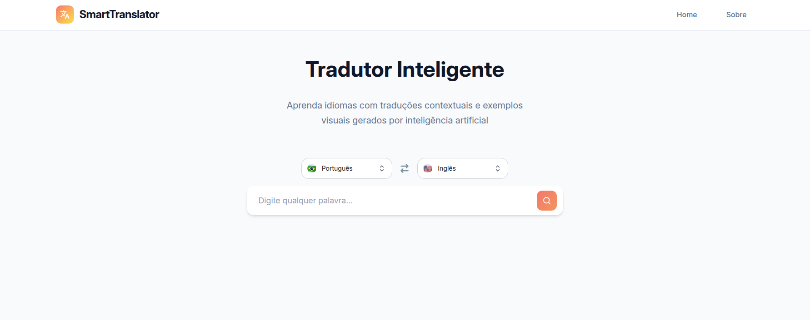

# SmartTranslator



> 🔗 **Acesse o projeto online:** https://smart-translator-kappa.vercel.app/

## Introdução

Este é um projeto acadêmico desenvolvido para a disciplina de Sistemas distribuídos da Universidade Federal do Rio Grande (FURG).

O SmartTranslator é uma plataforma web de aprendizado de idiomas que vai além da tradução simples. Ao digitar uma palavra, a aplicação utiliza Inteligência Artificial (Google Gemini) para gerar traduções, frases de exemplo e tópicos relacionados, enquanto consome a API do Unsplash para exibir imagens que criam um contexto visual relevante.

## Funcionalidades

* Tradução de palavras entre múltiplos idiomas.
* Geração de frases de exemplo contextuais usando a API do Gemini.
* Geração de palavras-chave e tópicos relacionados (ex: "Cotidiano", "Trabalho").
* Exibição de galeria de imagens relevantes da API do Unsplash.
* Interface reativa com estado de *loading* durante as chamadas de API.

## Tecnologias Utilizadas

* **Frontend:** React (com Vite.js)
* **Linguagem:** TypeScript
* **APIs Consumidas:**
    * Google Gemini (via `@google/genai`)
    * Unsplash API (via `fetch`)

---

## Como Executar o Projeto

Siga os passos abaixo para executar o projeto em sua máquina local.

### 1. Pré-requisitos

* Node.js (v18 ou superior)
* Gerenciador de pacotes (`npm` ou `yarn`)
* Chaves de API para o **Google Gemini** e **Unsplash**

### 2. Clonar o Repositório

```bash
git clone https://github.com/DaviSant0s/SmartTranslator.git
cd SmartTranslator
```

### 3. Instalar Dependências
```bash
npm install
# ou
yarn install
```

### 4. Executar o Projeto
```bash
npm run dev
# ou
yarn dev
```